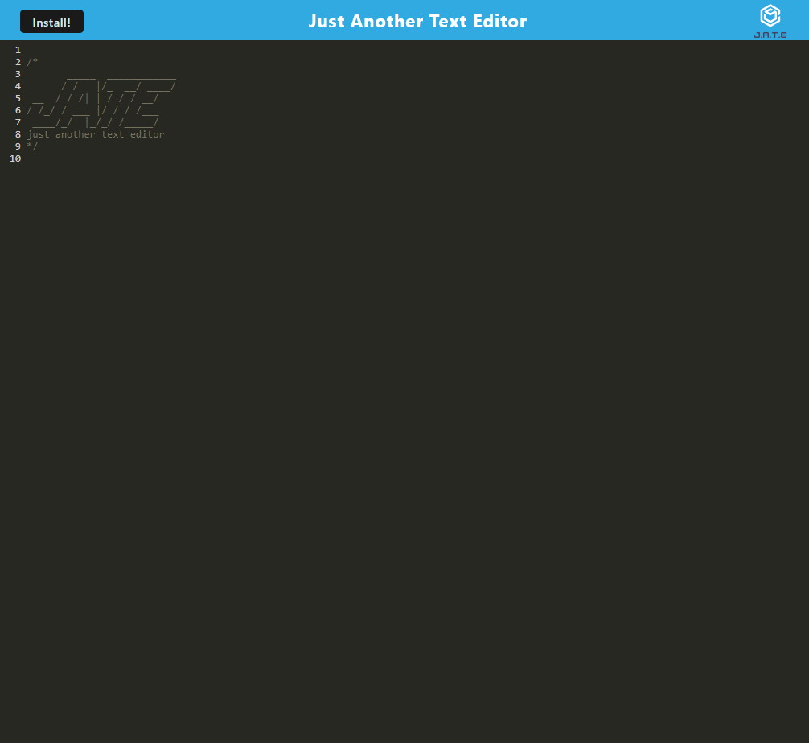

# Text Editor 

## Description:

For this project, my aim was to to build a text editor that runs in the browser. The app is a single-page application that meets the PWA criteria. Additionally, it features a number of data persistence techniques that serve as redundancy in case one of the options is not supported by the browser. The application also functions offline.

## Table of contents:
- [Links](#links)
- [Usage](#usage)
- [Technologies Used](#technologies-used)
- [Screenshots](#screenshots)
- [Contribute](#contribute)

## Links:
### Application:
https://text-editor-am.herokuapp.com/

### Github:

https://github.com/AsmaaMusse/text-editor

## Technologies Used:

- HTML/ CSS
- Express.js
- JavaScript
- IndexedDB API
- idb

## Usage:

### Installation

```
git@github.com:AsmaaMusse/text-editor.git
cd text-editor
npm install / npm i
```

### Seed

```
No seeding needed for this project
```

### Start

```
npm run start
```

## Screenshot:



## Contribute

To contribute or ask questions, please <a href="https://mail.google.com/mail/u/0/?tf=cm&to=asmaamusse03@gmail.com&cc&bcc&su&body&fs=1">Email</a> here
